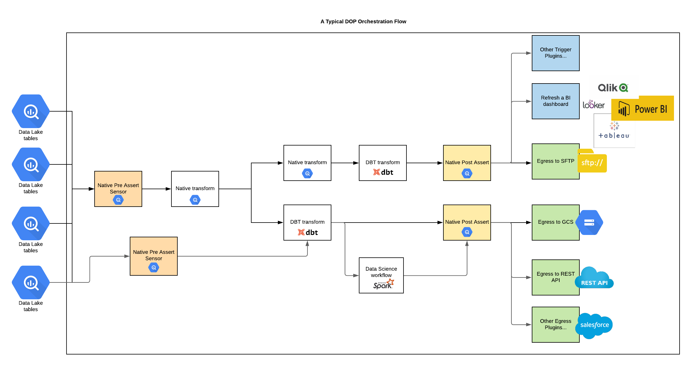
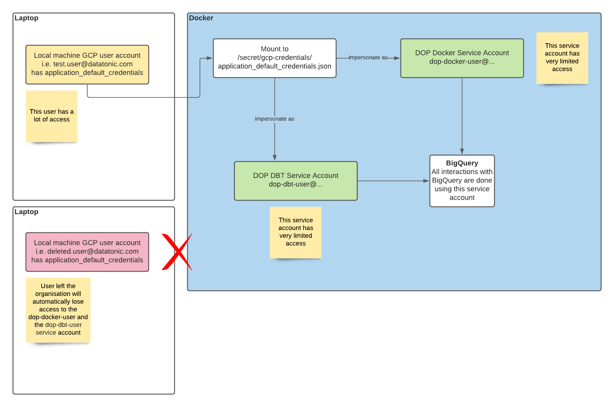

Table of contents
=================
* [What is DOP](#what-is-dop)
  * [Design Concept](#design-concept)
  * [A Typical DOP Orchestration Flow](#a-typical-dop-orchestration-flow)
* [Prerequisites - Run in Docker](#prerequisites---run-in-docker)
  * [For DOP Native Features](#for-dop-native-features)
  * [For DBT](#for-dbt)
* [Instructions for Setting things up](#instructions-for-setting-things-up)
  * [Run Airflow with DOP in Docker - Mac](#run-airflow-with-dop-in-docker---mac)
  * [Run Airflow with DOP in Docker - Windows](#run-airflow-with-dop-in-docker---windows)
  * [Run on Composer](#run-on-composer)
     * [Prerequisites](#prerequisites)
     * [Create Composer Cluster](#create-composer-cluster)
     * [Deployment](#deployment)
* [Misc](#misc)
  * [Service Account Impersonation](#service-account-impersonation)

# What is DOP
## Design Concept
DOP is designed to simplify the orchestration effort across many connected components using a configuration file without the need to write any code.
We have a vision to make orchestration easier to manage and more accessible to a wider group of people.

Here are some of the key design concept behind DOP,
- Built on top of Apache Airflow - Utilises it’s DAG capabilities with interactive GUI
- DAGs without code - YAML + SQL
- Native capabilities (SQL) - Materialisation, Assertion and Invocation
- Extensible via plugins - DBT job, Spark job, Egress job, Triggers, etc
- Easy to setup and deploy - fully automated dev environment and easy to deploy
- Open Source - open sourced under the MIT license

**Please note that this project is heavily optimised to run with GCP (Google Cloud Platform) services which is our current focus. By focusing on one cloud provider, it allows us to really improve on end user experience through automation**

## A Typical DOP Orchestration Flow


# Prerequisites - Run in Docker
Note that all the IAM related prerequisites will be available as a Terraform template soon!

## For DOP Native Features
1. Download and install Docker https://docs.docker.com/get-docker/ (if you are on Windows, please follow instruction here as there are some additional steps required for it to work https://docs.docker.com/docker-for-windows/install/)
1. Download and install Google Cloud Platform (GCP) SDK following instructions here https://cloud.google.com/sdk/docs/install.
1. Create a dedicated service account for docker with limited permissions for the `development` GCP project, the Docker instance is not designed to be connected to the production environment
    1. Call it `dop-docker-user@<your GCP project id>` and create it in `https://console.cloud.google.com/iam-admin/serviceaccounts?project=<your GCP project id>`
    1. Assign the `roles/bigquery.dataEditor` and `roles/bigquery.jobUser` role to the service account under `https://console.cloud.google.com/iam-admin/iam?project=<your GCP project id>`
1. Your GCP user / group will need to be given the `roles/iam.serviceAccountUser` and the `roles/iam.serviceAccountTokenCreator` role on the`development` project just for the `dop-docker-user` service account in order to enable [Service Account Impersonation](#service-account-impersonation).

1. Authenticating with your GCP environment by typing in `gcloud auth application-default login` in your terminal and following instructions. Make sure you proceed to the stage where `application_default_credentials.json` is created on your machine (For windows users, make a note of the path, this will be required on a later stage)
1. Clone this repository to your machine.

## For DBT
1. Setup a service account for your GCP project called `dop-dbt-user` in `https://console.cloud.google.com/iam-admin/serviceaccounts?project=<your GCP project id>`
1. Assign the `roles/bigquery.dataEditor` and `roles/bigquery.jobUser` role to the service account at project level under `https://console.cloud.google.com/iam-admin/iam?project=<your GCP project id>`
1. Your GCP user / group will need to be given the `roles/iam.serviceAccountUser` and the `roles/iam.serviceAccountTokenCreator` role on the `development` project just for the `dop-dbt-user` service account in order to enable [Service Account Impersonation](#service-account-impersonation).

# Instructions for Setting things up

## Run Airflow with DOP in Docker - Mac

See [README in the service project setup](examples/service_project/README.md) and follow instructions.

Once it's setup, you should see example DOP DAGs such as `dop__example_covid19`


## Run Airflow with DOP in Docker - Windows
This is currently working in progress, however the instructions on what needs to be done is in the [Makefile](examples/service_project/Makefile)

## Run on Composer

### Prerequisites
1. Create a dedicate service account for Composer and call it `dop-composer-user` with following roles at project level
    - roles/bigquery.dataEditor
    - roles/bigquery.jobUser
    - roles/composer.worker
    - roles/compute.viewer
1. Create a dedicated service account for DBT with limited permissions.
    1. [Already done in here if it’s DEV] Call it `dop-dbt-user@<GCP project id>` and create in `https://console.cloud.google.com/iam-admin/serviceaccounts?project=<your GCP project id>`
    1. [Already done in here if it’s DEV] Assign the `roles/bigquery.dataEditor` and `roles/bigquery.jobUser` role to the service account at project level under `https://console.cloud.google.com/iam-admin/iam?project=<your GCP project id>`
    1. The `dop-composer-user` will need to be given the `roles/iam.serviceAccountUser` and the `roles/iam.serviceAccountTokenCreator` role just for the `dop-dbt-user` service account in order to enable [Service Account Impersonation](#service-account-impersonation).

### Create Composer Cluster
1. Use the service account already created `dop-composer-user` instead of the default service account
1. Use the following environment variables
    ```
    DOP_PROJECT_ID : {REPLACE WITH THE GCP PROJECT ID WHERE DOP WILL PERSIST ALL DATA TO}
    DOP_LOCATION : {REPLACE WITH GCP REGION LOCATION WHRE DOP WILL PERSIST ALL DATA TO}
    DOP_SERVICE_PROJECT_PATH := {REPLACE WITH THE ABSOLUTE PATH OF THE Service Project, i.e. /home/airflow/gcs/dags/dop_{service project name}
    DOP_INFRA_PROJECT_ID := {REPLACE WITH THE GCP INFRASTRUCTURE PROJECT ID WHERE BUILD ARTIFACTS ARE STORED, i.e. a DBT docker image stored in GCR}
    ```
   and optionally
   ```
   DOP_GCR_PULL_SECRET_NAME:= {This maybe needed if the project storing the gcr images are not he same as where Cloud Composer runs, however this might be a better alternative https://medium.com/google-cloud/using-single-docker-repository-with-multiple-gke-projects-1672689f780c}
   ```
1. Add the following Python Packages
    ```
    dataclasses==0.7
    ```
1. Finally create a new node pool with the following k8 label
    ```
    key: cloud.google.com/gke-nodepool
    value: kubernetes-task-pool
    ```

### Deployment
See [Service Project README](examples/service_project/README.md#deploy-to-cloud-composer)

# Misc
## Service Account Impersonation
Impersonation is a GCP feature allows a user / service account to impersonate as another service account.
This is a very useful feature and offers the following benefits
- When doing development locally, especially with automation involved (i.e using Docker), it is very risky to interact with GCP services by using your user account directly because it may have a lot of permissions. By impersonate as another service account with less permissions, it is a lot safer (least privilege)
- There is no credential needs to be downloaded, all permissions are linked to the user account. If an employee leaves the company, access to GCP will be revoked immediately because the impersonation process is no longer possible

The following diagram explains how we use Impersonation in DOP when it runs in Docker


And when running DBT jobs on production, we are also using this technique to use the composer service account to impersonate as the `dop-dbt-user` service account so that service account keys are not required.

There are two very google articles explaining how impersonation works and why using it
- [Using ImpersonatedCredentials for Google Cloud APIs](https://medium.com/google-cloud/using-impersonatedcredentials-for-google-cloud-apis-14581ca990d8)
- [Stop Downloading Google Cloud Service Account Keys!](https://medium.com/@jryancanty/stop-downloading-google-cloud-service-account-keys-1811d44a97d9)


## Pre-commit Linter
[pre-commit](https://pre-commit.com/) tool runs a number of checks against the code, enforcing that all the code pushed to the repository follows the same guidelines and best practices. In this project the checks are:
* Trim trailing whitespaces
* Fix end-of-file
* YAML file format
* Python code formatter using [Black](https://black.readthedocs.io/en/stable/)
* Python style guide using [Flake8](https://flake8.pycqa.org/en/latest/)

To install locally, follow the [installation guide](https://pre-commit.com/index.html#install) in the pre-commit page

The normal usage is to run `pre-commit run` after staging files. If the [git hook](https://pre-commit.com/index.html#3-install-the-git-hook-scripts) has been installed, pre-commit will run automatically on `git commit`.
