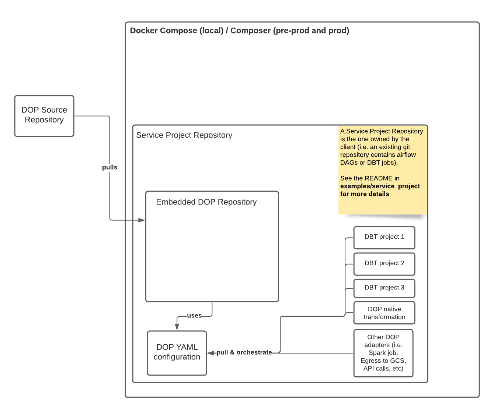

The `service_project` directory can be used as a boilerplate to setup DOP on an existing GIT repository (the service project repository).
You can copy and paste everything in this directory (including `.gcloudignore` and `.gitignore` as these are required for DOP to function correctly). 
If you already have a `Makefile` or any other conflicting files, you may need to move things around by merging those files or moving i.e. the `Makefile` into `embedded_dop`

Table of contents
=================
* [DOP Service Project Architecture](#dop-service-project-architecture)
* [Boilerplate structure explained](#boilerplate-structure-explained)
 * [DBT Projects](#dbt-projects)
 * [The embedded_dop directory](#the-embedded_dop-directory)
    * [executor_config](#executor_config)
    * [orchestration](#orchestration)
    * [source](#source)
 * [The Makefile](#the-makefile)
* [Use DOP on Docker](#use-dop-on-docker)
* [Deploy to Cloud Composer](#deploy-to-cloud-composer)
 * [Build Artifact](#build-artifact)
 * [Deploy](#deploy)
    * [Important steps to follow for deploying to an existing Composer Cluster](#important-steps-to-follow-for-deploying-to-an-existing-composer-cluster)
* [DOP Orchestration Explained](#dop-orchestration-explained)

## DOP Service Project Architecture
This explains how DOP functions and how it can be integrated into your existing git repositories
  

## Boilerplate structure explained

### DBT Projects
Currently the setup is optimised to orchestrate and run DBT jobs on Google Cloud and this directory can be used as a template in your service project to quickly setup DOP with multiple DBT projects.

For this to work, the service project repository must contain one or multiple DBT projects, each of them in their own folder. 
For example, 
```
dbt_project_1/dbt_project.yaml
dbt_project_1/...

dbt_project_2/dbt_project.yaml
dbt_project_2/...
```

### The embedded_dop directory
There are three main folders within this directory. 

#### executor_config
This folder contains files required to build docker containers to be used on Cloud Composer and invoked via the Airflow K8 Pod Operator. 

For example, 
- the `dbt/config.yaml` file contains instructions to tell the build process where to locate the DBT projects inside this repository
- `Pipfile` and `Pipfile.lock` are used to maintain and lock Python dependencies so what's installed inside the docker container is always the same after each build   

Currently this is not used on the sandbox environment when running locally with Docker Compose, DBT is still installed on the fly using dynamically created Python Virtual environment but this may change in the future. 

#### orchestration 
This folder contains some example orchestration jobs and it shows how DOP can be used to orchestrate the flow between DBT jobs, native transformations and any executors added in the future.  
It's probably a good idea to look through these examples which will give you a good idea on how to orchestrate workload in DOP.

#### source
This is a directory reserved to store the DOP code, you won't see it in this repository because it's ignored by version control but when the build process runs, the DOP source code will be checked out to here.  

### The Makefile
The `Makefile` contains instructions to automate the whole initialization process for DOP including checking out the DOP repository as well as defining required variables.
For the Makefile to work, placeholders (as defined in `#{}`) must be replaced with real values in the Makefile or overwritten via make command arguments. 

## Use DOP on Docker
You can now use DOP on your laptop (Linux / Mac only for now, Windows instructions is in the works) by following the instructions as below. 

Running it for the first time (this builds the docker image from scratch and may take a while, you can check where it got to with `make logs`)
```
make build
```

Once it's up and running, you can access the UI on 
```
http://localhost:8082
```

Bring down the docker environment
```
make down
```

Subsequent runs to bring up the docker environment
```
make up
```

And to get into the docker container itself (useful for debugging), run
```
make exec
```

## Deploy to Cloud Composer
There is a light weight semi-automated deployment process built using Cloud Build, to deploy to an existing Composer Cluster, follow instructions as below.

### Build Artifact
```
make build-artifact
```
This will produce an artifact id pointed to the most recent build.

By default this will build the artifact using the DOP `master` branch, if a different branch or tag is required, this can be overwritten by using `DOP_TAG_NAME`, i.e. `DOP_TAG_NAME=v0.1.0`. 

```
make build-artifact DOP_TAG_NAME={}
```

It is **very important** to consider using a tag made on the DOP source repository for a Production deployment so that the DOP version won't accidentally change when making a service project deployment.


### Deploy
```
make deploy DOP_INFRA_PROJECT_ID={} DEPLOY_BUCKET_NAME={} DOP_ARTIFACT_ID={}
```
`DOP_INFRA_PROJECT_ID`: This is the gcp infrastructure project id where build artifacts are stored. i.e. a DBT docker image stored in GCR
`DEPLOY_BUCKET_NAME`: This is the bucket name for Cloud Composer i.e. `us-central1-dop-sandbox-us-xxxxxxxx-bucket`
`DOP_ARTIFACT_ID`: Use the most recent artifact id produced by the `Build Artifact` step or any historical artifact ids to rollback

#### Important steps to follow for deploying to an existing Composer Cluster
If you are deploying DOP to an existing composer cluster which often already has other DAGs running, 
it is important to set some exclusions in your existing deployment process.  

A typical deployment to Cloud Composer involves doing a rsync to a GCS bucket, in order to make sure the DOP service project path is not removed in this process add the following exclusions in the rsync. 
```
export SERVICE_PROJECT_NAME=dop_<service project repository name> && gsutil -m rsync -r -d -x "^$SERVICE_PROJECT_NAME" gs://<path to dags>/dags gs://$BUCKET_NAME/dags
``` 

## DOP Orchestration Explained
TODO...